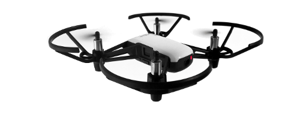

# *Pythonic* DJI Ryze Tello Workbench

This (still growing) repository contains scripts, documentation, hints and helpful assets to enable one creating an application capable of controlling and monitoring the flight of a DJI Ryze Tello drone with Python.

## Communication

All communication between the DJI Ryze Tello and an application is done by means of 802.11 frames in a IP-based manner.

### Live streaming

An implementation as exemplary for extraction and reassembly of a h.264 video frame from a snippet of a captured live stream can be found [here](../example/video).

## Credits

- Ryze Technology -- [Tello SDK](https://dl-cdn.ryzerobotics.com/downloads/tello/0228/Tello+SDK+Readme.pdf)
- Ryze Technology -- [Tello Python3 Control Demo](https://dl-cdn.ryzerobotics.com/downloads/tello/20180222/Tello3.py)
- MAVProxyUser -- [Firmware images](https://github.com/MAVProxyUser/RyzeTelloFirmware)